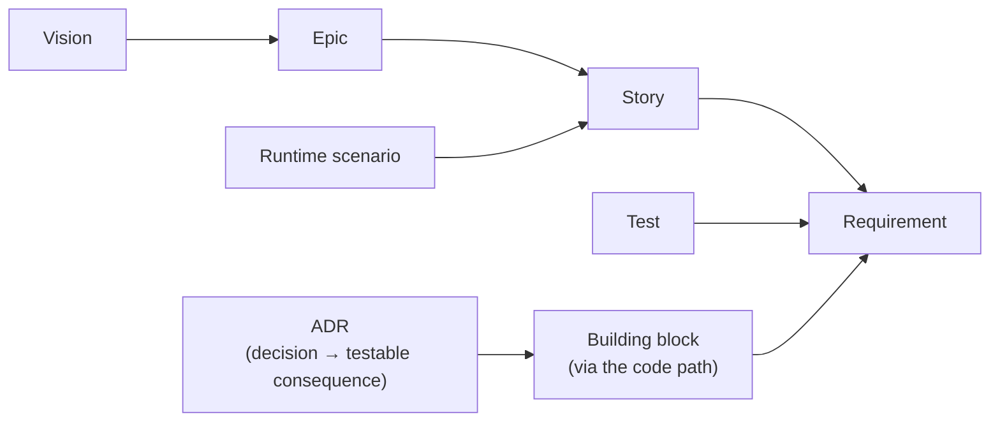
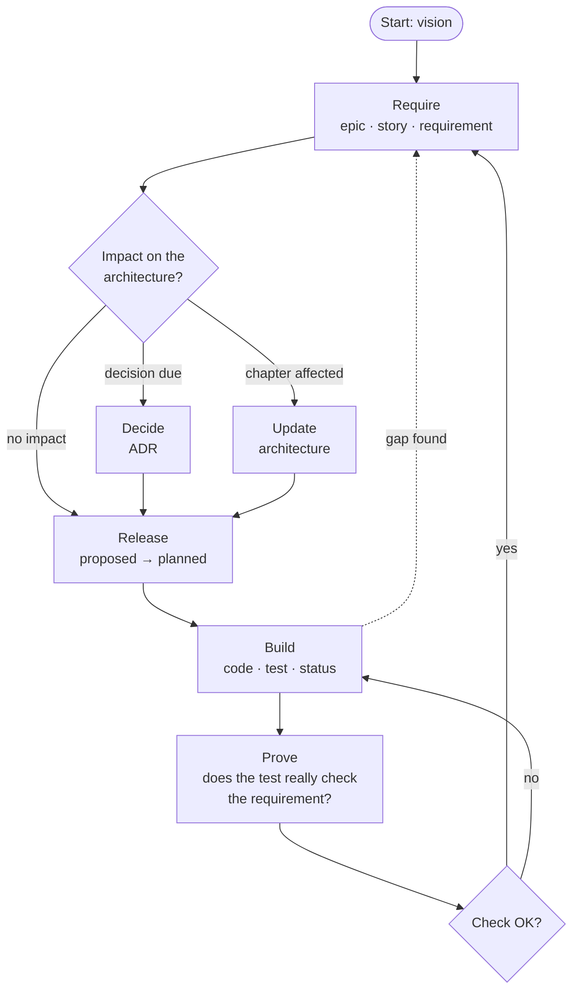

<!-- docspine 0.19 · source: standard/en/README.md · do not edit in projects -->

# Documentation according to docspine

This documentation is based on [arc42](https://arc42.org) and maintained with
[docspine](https://github.com/flaechsig/docspine): requirements, architecture and
decisions form **one document**, spread across many small files, connected by fixed IDs
and controlled by a checker. The documentation is the spine of the development: tests
prove requirements, and the build checks that documentation and code agree. This page
explains
the structure and the way of working. What applies in detail is in
`.docspine/STANDARD.md`, this project's values are in `.docspine/PROFILE.md`.

- **What it is about:** [Vision](01-goals/vision.md)
- **Where things stand:** [Epics, stories and their status](01-goals/README.md)

## Structure

The documentation is **one document**, based on the twelve chapters of
[arc42](https://arc42.org). Chapter 1 also holds the complete specification, so that
requirements and architecture do not drift apart in two documents. Chapter 9 consists
of the individual decisions, chapter 10 is generated, and a chapter exists only once
it has content.

| Chapter | Content |
|---|---|
| 1 Goals | vision, epics, stories and requirements; overview with status |
| 2 Constraints | what is fixed from outside: technology, norms, organisation |
| 3 Context | neighbouring systems and users |
| 4 Strategy | the fundamental solution approach |
| 5 Building blocks | the parts of the system, one block per file |
| 6 Runtime | how the parts interact, one scenario per file |
| 7 Deployment | where things run |
| 8 Concepts | domain and technical concepts that apply across the system |
| 9 Decisions | architecture decisions (ADRs) |
| 10 Quality | quality requirements, generated |
| 11 Risks | risks and technical debt |
| 12 Glossary | terms |

Folders, file names and metadata are in English; the content is in the project
language. The exact layout is in `.docspine/STANDARD.md`, section 2.1.

## Controlling files

Besides the content, a few files control how the documentation is worked on: the rules
(`STANDARD.md`), this project's values (`PROFILE.md`), the entry point for AI agents
(`AGENTS.md`) and the skills. Some of them come from docspine and must not be edited
in the project. Which ones, and why, is in `.docspine/STANDARD.md`, section 2.2.

## How the parts fit together

- Every statement has **exactly one source file**. Other places refer to it by ID or
  show its content in a generated region (`<!-- generated:… -->`). Never edit such
  regions by hand.
- **IDs are immutable.** If a requirement changes in content, a new one is created and
  the old one is superseded.
- **The checker decides whether something is implemented**, not a person and not an
  AI: a requirement counts as implemented when a test or a piece of evidence proves it.

## Way of working

Work runs as a cycle. Each step has a skill (`spine-*`) that guides through it. The
skills follow the open Agent Skills standard and work with various AI tools. Without
skills it works just the same; the rules are in `.docspine/STANDARD.md`.

| Step | What happens | Skill |
|---|---|---|
| **Start** | A first description turns into vision, themes and constraints. Whatever is open stays as a question. | `spine-init` |
| **Require** | A need becomes a story and a requirement: who, what, why, how to check. | `spine-require` |
| **Check impact** | Must the architecture take something into account, change or decide something? | `spine-impact` |
| **Decide** | A due decision is recorded with alternatives and rationale. | `spine-decide` |
| **Release** | A described requirement is released for building (`proposed` → `planned`). This is a person's decision, for single requirements or in batches. | — |
| **Build** | Code and test are written for released requirements; the test carries the requirement ID. Once it passes, the status changes. | `spine-build` |
| **Prove** | Does the test really check what the requirement demands, or does it only carry the ID? | `spine-prove` |

Specifying and building are separate: the specification steps never write code, and
building starts only with a release. You can work through the whole specification first
and build later, or release and build each requirement right away.

Four rules apply in every step:

- **People decide what applies.** Skills and AIs propose; files are written after
  approval.
- **Nothing is invented.** What nobody knows stays `UNKNOWN`, with the open question.
- **Gaps lead back.** If building shows that a requirement is missing or the
  architecture does not hold, go back to the matching step instead of bridging the gap
  in code.
- **Every change on its own branch.** Merged into the main branch only when the check
  reports `OK`. IDs become final there; this is what lets a small team work in parallel
  (`.docspine/STANDARD.md`, section 2.7).

Instructions for wiring the checker into a build or adopting an existing project, and
for installation, are on the [docspine page](https://github.com/flaechsig/docspine).

## Acknowledgements

docspine invents little; it combines proven work:

- **[arc42](https://arc42.org)** by Gernot Starke and Peter Hruschka: the outline of
  this document and the idea of documenting architecture pragmatically and step by step.
- **[IREB](https://www.ireb.org)** (International Requirements Engineering Board) with
  the CPRE syllabus: the terms and principles of requirements engineering on which
  vision, story and requirement build.
- **[EARS](https://alistairmavin.com/ears/)** (Easy Approach to Requirements Syntax) by
  Alistair Mavin and colleagues: the sentence structure that makes requirements
  unambiguous and testable.
- **[Architecture Decision Records](https://adr.github.io)**, described by Michael
  Nygard: record decisions with their rationale, never rewrite them, only supersede.
- **[Mermaid](https://mermaid.js.org)** by Knut Sveidqvist and the community: diagrams
  as text.
- **[Agent Skills](https://agentskills.io)**, published by Anthropic as an open
  standard, and **[AGENTS.md](https://agents.md)**: tool-independent ways to give AI
  agents workflows and an entry point.
- The **docs-as-code** movement: keep, check and version documentation in the
  repository like code.
