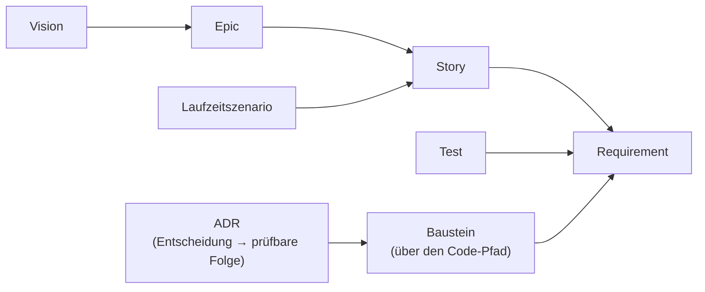
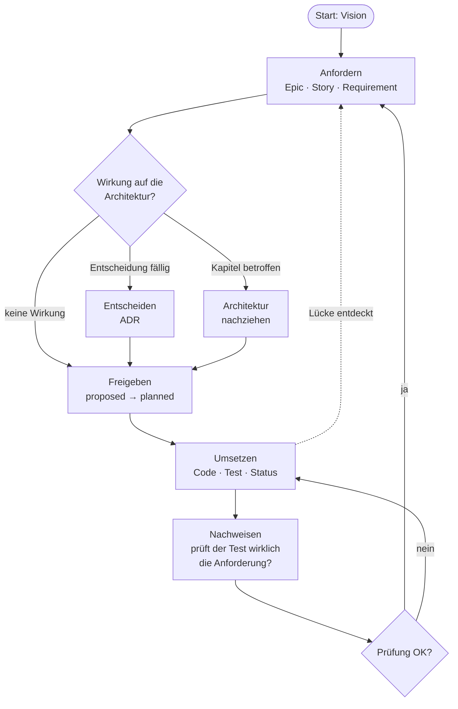

<!-- docspine 0.20 · from standard/en/README.md · übersetzt, nicht von Hand editieren -->

# Dokumentation nach docspine

Diese Dokumentation ist in Anlehnung an [arc42](https://arc42.org) aufgebaut und wird
mit [docspine](https://github.com/flaechsig/docspine) geführt: Anforderungen, Architektur
und Entscheidungen bilden **ein Dokument**, verteilt auf viele kleine Dateien, verbunden
über feste IDs und von einem Prüfwerkzeug kontrolliert. Die Dokumentation ist das Rückgrat
der Entwicklung: Tests weisen Requirements nach, und der Build prüft, dass Doku und Code
übereinstimmen. Diese Seite erklärt den Aufbau und die Arbeitsweise. Was im Einzelnen gilt, steht in
`.docspine/STANDARD.md`, die Werte dieses Projekts in `.docspine/PROFILE.md`.

- **Worum es geht:** [Vision](01-goals/vision.md)
- **Wo es steht:** [Epics, Stories und ihr Status](01-goals/README.md)

## Aufbau

Die Dokumentation ist **ein Dokument**, angelehnt an die zwölf Kapitel von
[arc42](https://arc42.org). Kapitel 1 enthält zusätzlich die ganze Spezifikation,
damit Anforderungen und Architektur nicht in zwei Dokumenten auseinanderlaufen.
Kapitel 9 besteht aus den einzelnen Entscheidungen, Kapitel 10 wird erzeugt, und ein
Kapitel existiert erst, wenn es Inhalt hat.

| Kapitel | Inhalt |
|---|---|
| 1 Ziele | Vision, Epics, Stories und Requirements; Übersicht mit Status |
| 2 Randbedingungen | was von außen feststeht: Technik, Normen, Organisation |
| 3 Kontext | Nachbarsysteme und Nutzer |
| 4 Strategie | der grundlegende Lösungsansatz |
| 5 Bausteine | die Teile des Systems, ein Baustein je Datei |
| 6 Laufzeit | wie die Teile zusammenwirken, ein Szenario je Datei |
| 7 Verteilung | wo was läuft |
| 8 Konzepte | fachliche und technische Konzepte, die übergreifend gelten |
| 9 Entscheidungen | Architekturentscheidungen (ADRs) |
| 10 Qualität | Qualitätsanforderungen, generiert |
| 11 Risiken | Risiken und technische Schulden |
| 12 Glossar | Begriffe |

Ordner, Dateinamen und Metadaten sind englisch, die Inhalte stehen in der
Projektsprache. Die genaue Gliederung steht in `.docspine/STANDARD.md`, Abschnitt 2.1.

## Steuernde Dateien

Neben den Inhalten steuern einige Dateien, wie mit der Dokumentation gearbeitet wird:
die Regeln (`STANDARD.md`), die Werte dieses Projekts (`PROFILE.md`), der Einstieg für
KI-Agenten (`AGENTS.md`) und die Skills. Einige davon kommen aus docspine und werden im
Projekt nicht geändert. Welche, und warum, steht in `.docspine/STANDARD.md`,
Abschnitt 2.2.

## Wie die Teile zusammenhängen

- Jede Aussage hat **genau eine Quelldatei**. Andere Stellen verweisen über die ID oder
  blenden den Inhalt in einem generierten Bereich ein (`<!-- generated:… -->`). Solche
  Bereiche nie von Hand ändern.
- **IDs sind unveränderlich.** Ändert sich eine Anforderung inhaltlich, entsteht eine
  neue, und die alte wird abgelöst.
- **Ob etwas umgesetzt ist, entscheidet das Prüfwerkzeug**, nicht ein Mensch und nicht
  eine KI: Ein Requirement gilt als umgesetzt, wenn ein Test oder ein Beleg es nachweist.

## Arbeitsweise

Die Arbeit läuft als Kreislauf. Jeder Schritt hat einen Skill (`docspine-*`), der durch ihn
führt. Die Skills folgen dem offenen Agent-Skills-Standard und funktionieren mit
verschiedenen KI-Werkzeugen. Ohne Skills geht es genauso, die Regeln stehen in
`.docspine/STANDARD.md`.

| Schritt | Was passiert | Skill |
|---|---|---|
| **Start** | Aus einer ersten Beschreibung entstehen Vision, Themen und Randbedingungen. Offenes bleibt als Frage stehen. | `docspine-init` |
| **Anfordern** | Ein Bedürfnis wird zu Story und Requirement: wer, was, warum, woran prüfbar. | `docspine-require` |
| **Wirkung prüfen** | Muss die Architektur etwas berücksichtigen, ändern oder entscheiden? | `docspine-impact` |
| **Entscheiden** | Eine fällige Entscheidung wird mit Alternativen und Begründung festgehalten. | `docspine-decide` |
| **Freigeben** | Ein beschriebenes Requirement wird zum Bau freigegeben (`proposed` → `planned`). Das entscheidet ein Mensch, einzeln oder gesammelt. | — |
| **Umsetzen** | Code und Test entstehen, der Test trägt die Requirement-ID. Ist er grün, wechselt der Status. | `docspine-build` |
| **Nachweisen** | Prüft der Test wirklich, was das Requirement fordert, oder trägt er nur die ID? | `docspine-prove` |

Spezifizieren und Bauen sind getrennt: Die Schritte der Spezifikation schreiben nie
Code, und gebaut wird erst nach einer Freigabe. Man kann sich erst durch die ganze
Spezifikation arbeiten und später bauen, oder jedes Requirement gleich freigeben und
umsetzen.

Vier Regeln gelten in jedem Schritt:

- **Der Mensch sagt, was gilt.** Skills und KIs schlagen vor, geschrieben wird nach
  Freigabe.
- **Nichts erfinden.** Was niemand weiß, bleibt `UNKNOWN` mit der offenen Frage dazu.
- **Lücken führen zurück.** Zeigt sich beim Umsetzen, dass eine Anforderung fehlt oder
  die Architektur nicht trägt, geht es zurück zum passenden Schritt, statt die Lücke im
  Code zu überbrücken.
- **Jede Änderung auf einem eigenen Branch.** Zusammengeführt wird erst, wenn die Prüfung
  `OK` meldet. Erst dort werden IDs endgültig; so kann ein kleines Team parallel arbeiten
  (`.docspine/STANDARD.md`, Abschnitt 2.7).

Wer das Prüfwerkzeug in den Build einbinden oder ein bestehendes Projekt übernehmen will,
findet Anleitung und Installation auf der [docspine-Seite](https://github.com/flaechsig/docspine).

## Dank

docspine erfindet wenig neu, sondern verbindet bewährte Arbeiten:

- **[arc42](https://arc42.org)** von Gernot Starke und Peter Hruschka: die Gliederung
  dieses Dokuments und der Gedanke, Architektur pragmatisch und schrittweise zu
  dokumentieren.
- **[IREB](https://www.ireb.org)** (International Requirements Engineering Board) mit
  dem CPRE-Lehrplan: die Begriffe und Grundsätze des Requirements Engineering, auf
  denen Vision, Story und Requirement aufbauen.
- **[EARS](https://alistairmavin.com/ears/)** (Easy Approach to Requirements Syntax) von
  Alistair Mavin und Kollegen: der Satzbau, der Anforderungen eindeutig und prüfbar macht.
- **[Architecture Decision Records](https://adr.github.io)**, beschrieben von Michael
  Nygard: Entscheidungen samt Begründung festhalten und nie umschreiben, nur ablösen.
- **[Mermaid](https://mermaid.js.org)** von Knut Sveidqvist und der Community:
  Diagramme als Text.
- **[Agent Skills](https://agentskills.io)**, von Anthropic als offener Standard
  veröffentlicht, und **[AGENTS.md](https://agents.md)**: werkzeugübergreifende Wege,
  KI-Agenten Abläufe und Einstieg mitzugeben.
- Die **Docs-as-Code**-Bewegung: Dokumentation wie Code im Repo führen, prüfen und
  versionieren.
